<h1 align="center">
  Teste Técnico - Back End - Mão na Massa 🖐
</h1>

  
 

**Desafio:** desenvolver uma nova funcionalidade de gerenciamento de pessoas, da apresentação da proposta inicial a entrega final do código. Será ./’[ o digrama de classes, e o código fonte da funcionalidade.

<h2 align="center">
  Requisitos:
</h2>

A API desenvolvida deve permitir: 

- Criar, editar e consultar uma ou mais pessoas;

- Criar, editar e consultar um ou mais endereços de uma pessoa; e

- Poder indicar qual endereço será considerado o principal de uma pessoa.

Uma pessoa deve possuir os seguintes dados: 

- Nome completo

- Data de nascimento

- Endereços:

-> Logradouro

-> CEP

-> Número

-> Cidade

-> Estado

Requisitos mínimos necessários:

- O código deve ter cobertura total de condições;

- O código deve ter cobertura de linhas de no mínimo 80%;

- O código deve respeitar os conceitos de Design Patterns, SOLID e Clean Code; e

- Toda a API deve ser desenvolvida no formato REST.

## Tecnologias

- [Spring Boot](https://spring.io/projects/spring-boot)
- [Spring MVC](https://docs.spring.io/spring-framework/reference/web/webmvc.html)
- [Spring Data JPA](https://spring.io/projects/spring-data-jpa)
- [Java Bean Validation](https://docs.spring.io/spring-framework/reference/core/validation/beanvalidation.html)
- [H2](https://www.h2database.com/html/main.html)
- [Flyway](https://www.baeldung.com/database-migrations-with-flyway)
- [Lombok](https://projectlombok.org/features/)
- [AssertJ](https://assertj.github.io/doc/)

## Diagrama de Classes - Formato Mermaid

```mermaid
classDiagram
    class Address {
        + Long id
        + String streetAddress
        + String zipCode
        + int houseNumber
        + String city
        + String province
        + Boolean defaultAddress
        + Person person
    }

    class Person {
        + Long id
        + String fullName
        + LocalDate dateOfBirth
        + List<Address> addresses
    }

    class AddressDTO {
        + Long id
        + String streetAddress
        + String zipCode
        + int houseNumber
        + String city
        + String province
        + Boolean defaultAddress
    }

    class PersonDTO {
        + Long id
        + String fullName
        + LocalDate dateOfBirth
        + List<AddressDTO> addressList
    }

    class PersonService {
        --
        + create(PersonDTO data)
        + update(Long id, PersonDTO data)
        + findById(Long id)
        + findAll()
        + delete(Long id)
    }

    class AddressService {
        --
        + create(Long id, AddressDTO data)
        + update(Long idAddress, Long idPerson, AddressDTO data)
        + setDefaultAddress(Long idPerson, Long idAddress)
        + findById(Long id)
        + findAll()
        + delete(Long id)
    }

    class AddressServiceImpl {
        - AddressRepository addressRepository
        - PersonRepository personRepository
        --
        + create(Long id, AddressDTO data)
        + update(Long idAddress, Long idPerson, AddressDTO data)
        + setDefaultAddress(Long idPerson, Long idAddress)
        + findById(Long id)
        + findAll()
        + delete(Long id)
        + validateAddressAssociation(Address address, Long idPerson)
    }

    class PersonServiceImpl {
        - PersonRepository personRepository
        --
        + create(PersonDTO data)
        + update(Long id, PersonDTO data)
        + findById(Long id)
        + findAll()
        + delete(Long id)
    }

    class AddressRepository {
        + updateDefaultAddress(Long idPerson, Long idAddress)
    }

    class AddressConverter {
        + toDTO(Address entity)
        + toEntity(AddressDTO dto)
        + toDTOList(List<Address> entities)
        + toEntityList(List<AddressDTO> addressDTOS)
    }

    class PersonConverter {
        + toDTO(Person entity)
        + toEntity(PersonDTO dto)
        + toDTOList(List<Person> entities)
    }

    class ExceptionResponse {
        + Date timestamp
        + String message
        + String details
    }

    class PersonController {
        - PersonService personService
        --
        + create(PersonDTO data)
        + update(Long id, PersonDTO data)
        + findById(Long id)
        + findAll()
        + delete(Long id)
    }

    class AddressController {
        - AddressService addressService
        --
        + create(Long id, AddressDTO data)
        + update(Long idAddress, Long idPerson, AddressDTO data)
        + setDefaultAddress(Long idPerson, Long idAddress)
        + findById(Long id)
        + findAll()
        + delete(Long id)
    }

    AddressController --> AddressService
    PersonController --> PersonService

    PersonController --> PersonDTO : Uses
    AddressController --> AddressDTO : Uses

    PersonDTO --> AddressDTO : Contains

    ExceptionResponse --> ResourceNotFoundException
    ExceptionResponse --> AddressNotAssociatedException
    CustomizedResponseEntityExceptionHandler --> ExceptionResponse

    Person "1" --> "*" Address
    Address "0..*" --> "1" Person

    AddressConverter --> Address
    AddressConverter --> AddressDTO

    PersonConverter --> Person
    PersonConverter --> PersonDTO
```

